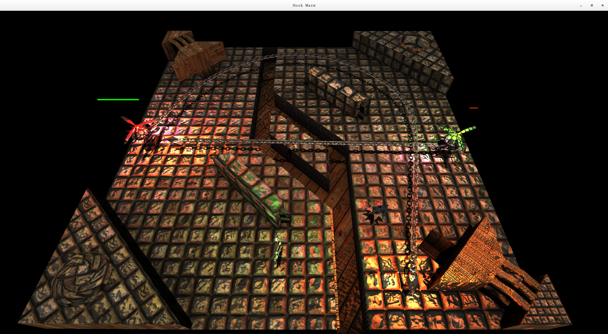

# HookWars
A minigame based on the popular Warcraft 3 mod "pugdewars"
.

## Building
  0. Checkout the dependencie branch on github or the master branch on gitlab
  1. Download dependencies `git submodule init && git submodule update`
  2. Build dependencies `make`
  3. Build the game `make`
  
If you encounter Assimp errors, just try make again. The tests use to fail but assimp.so is allready created.

## Playing
THIS WILL NOT WORK ON ANYTHING BUT NVIDIA GPUS WITH PROPRIETARY DRIVER!

The executable is `./game`

The goal of the game is to kill the enemies. (WOW!)

This can be accomplished by hooking them into traps, mines or just by hitting them. There are also heal-"stations"

Now you can use the analog sticks on your gamepad to move and rotate and the the should trigger (the analog ones) for shooting normal and grapple hooks.

If no XBox compatible controler is found the game will default to keyboard input.
Use 'WASDQERT' and 'HJKL'+Arrowkeys to control the players.

Created by
 * Maximilian Schander
 * Wanja Hentze
